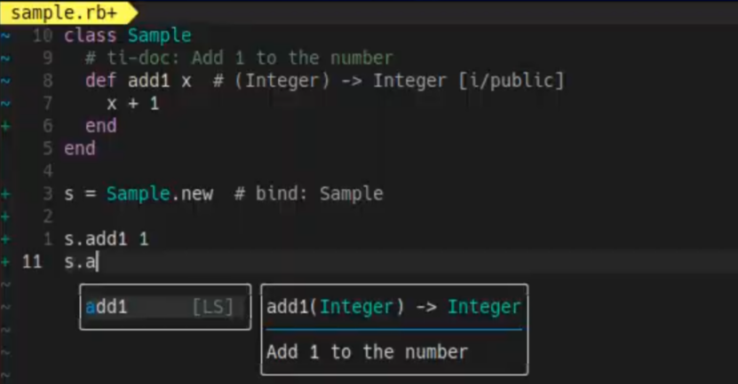
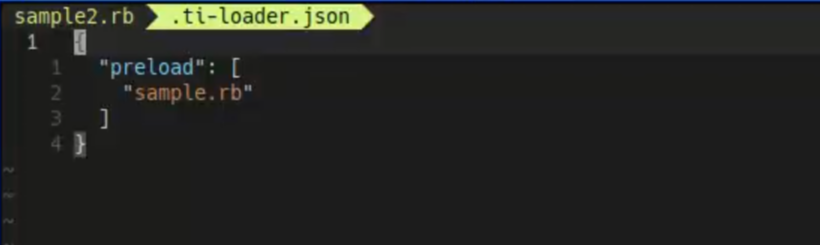

<div align="center">

# Ruby-TI

**Static type checking for MRuby. No annotations required.**

[](https://go.dev/)
[](LICENSE)

</div>

---

Ruby-TI is a static type analyzer for MRuby that performs type inference and checking on your Ruby code without requiring type annotations. Write Ruby naturally and get real-time type feedback in your editor.

**The power of static typing. The freedom of Ruby.**

<p align="center">
  
</p>

## Features

- **Zero-annotation type inference** - No need to write type signatures. Ruby-TI analyzes your code automatically
- **Real-time feedback** - Get instant type checking as you code through LSP integration
- **Customizable type system** - Define types that match your mruby environment
- **Editor integration** - Works with Neovim, VSCode, and any LSP-compatible editor
- **MRuby focused** - Built with embedded Ruby environments in mind

## Requirements

- **Go 1.24.5+** for building from source
- **Neovim** or **VSCode** (or any LSP-compatible editor)

## Quick Start

**Install Ruby-TI:**

```bash
git clone https://github.com/engneer-hamachan/ruby-ti.git
cd ruby-ti
make install

# Add to PATH (fish example):
set -x PATH "/path/to/ruby-ti/bin:$PATH"
```

**Install LSP Server:**

```bash
git clone https://github.com/engneer-hamachan/ruby-ti-lsp.git
cd ruby-ti-lsp
make install

# Add to PATH (fish example):
set -x PATH "/path/to/ruby-ti-lsp/bin:$PATH"
```

**Setup your project:**

```bash
cd your-ruby-project
cp -r /path/to/ruby-ti/.ti-config .
```

**Configure your editor** - See [Editor Setup](#editor-setup) for detailed configuration.

That's it! Open a Ruby file and start coding with type checking enabled.

## Editor Setup

<details>
<summary>Neovim (coc.nvim)</summary>

Add to your `coc-settings.json`:

```json
{
  "languageserver": {
    "ruby-ti": {
      "command": "ti-lsp",
      "filetypes": ["ruby", "json"]
    }
  }
}
```

</details>

<details>
<summary>VSCode</summary>

Install the extension:

```bash
code --install-extension /path/to/ruby-ti-lsp/vscode/ruby-ti-lsp-0.1.0.vsix
```

</details>

<details>
<summary>Other Editors</summary>

Configure your LSP client to run `ti-lsp` for Ruby files. The server follows standard LSP protocols.

</details>

## Screenshots

**Diagnostics** - Real-time type error detection

<p align="center">
  
</p>

**Hover Information** - Inspect types on hover

<p align="center">
  
</p>

**Auto-completion** - Intelligent code suggestions

<p align="center">
  
</p>

**Code Actions** - Quick fixes and refactoring

<p align="center">
  
</p>

**Inline Documentation** - View method documentation directly in editor

<p align="center">
  
</p>

**External File Loading** - Analyze types across multiple files

<p align="center">
  
</p>

<p align="center">
  
</p>

## Configuration

### Supported Classes

Ruby-TI is expanding support with a focus on **PicoRuby** and embedded environments:

`Array` · `Bool` · `Class` · `Enumerable` · `Float` · `GPIO` · `Hash` · `Integer` · `Kernel` · `Math` · `NilClass` · `Object` · `Proc` · `Range` · `String` · `Symbol`

More classes and PicoRuby features are being added continuously.

### Customization

The `.ti-config` directory contains type definitions that you can customize for your specific mruby environment. Edit the JSON files to define types that make sense for your workflow.

See the [Configuration Guide](./docs/ti-config.md) for detailed customization options.

## Documentation

- [.ti-config Configuration Guide](./docs/ti-config.md) - Customize type definitions for your environment

## Beta Feature (Code Navigator for AI Agents)
### Setup
After completing the Ruby-TI setup,
install the skills from the `skills` directory into your AI agent.
### Usage
#### ti-skills
```
/ti-skills app.rb {your prompt}
```

ti-skills is the core of the Code Navigator.
It uses Ruby-TI to perform code analysis and passes documents like the following to the AI agent:

````
# Method Signatures
## calculate_max_history_lines(Integer, Integer, String) -> Integer
- file: theme/editor_app.rb:1164
- document: returns max_visible_lines-1 when cursor is on new bottom line (cursor_row_index==-1) or temp_new_line_code is non-empty (reserves a row for the current input line); otherwise returns max_visible_lines
- call points:
  - theme/editor_app.rb:1172
    - method: calculate_scroll_offset
  - theme/editor_app.rb:1214
    - method: redraw_code_area
- total call points: 2

## calculate_scroll_offset(Array<untyped>, Integer, Integer, Integer, String) -> Integer
- file: theme/editor_app.rb:1170
- document: when editing existing line, adjusts scroll_offset so cursor_row_index is within the visible window; when on new bottom line, scrolls to show the last max_history_lines; returns new scroll_offset
- call points:
  - theme/editor_app.rb:1216
    - method: redraw_code_area
- total call points: 1

and more ...

---
# Special Code Comments
## theme/editor_app.rb:72
- comment: holds all editor state variables in a single object to reduce Hash return values
```
class EditorState
```
## theme/editor_app.rb:80
- comment: code being typed on the current (bottom) new line — empty string means no code yet
```
    @code = ''
```

and more ...
````
By using ti-skills, the AI agent reads the above documents before making code changes or additions,
significantly reducing the amount of code the AI agent needs to read during its work. (However, this may not always be the case.)

Additionally, the AI agent is instructed to automatically check for type errors after completing its work. (When type errors occur, it is instructed to only report them without attempting fixes. Though it doesn't always listen.)

#### ti-add-comments
```
/ti-add-comments app.rb
```
Adds code comments required for using ti-skills.

### Benefits
- Significantly reduces the amount of code the AI agent needs to read during its work.
- Eliminates the need to create elaborate documentation for the AI agent.
- Appears to have a positive impact on the AI agent's implementation accuracy when modifying code (perhaps because there is less extraneous information?).

### Known Issues
- Resolving type errors takes time (the AI cannot determine whether to fix the ti side, the .ti-config, or the code itself).


## Contributing

Issues and feedback are especially welcome! While the project is in active development and pull requests may be challenging to integrate, we'd love to hear about bugs, feature requests, and your experience using Ruby-TI.

## License

MIT License - see [LICENSE](LICENSE) for details
