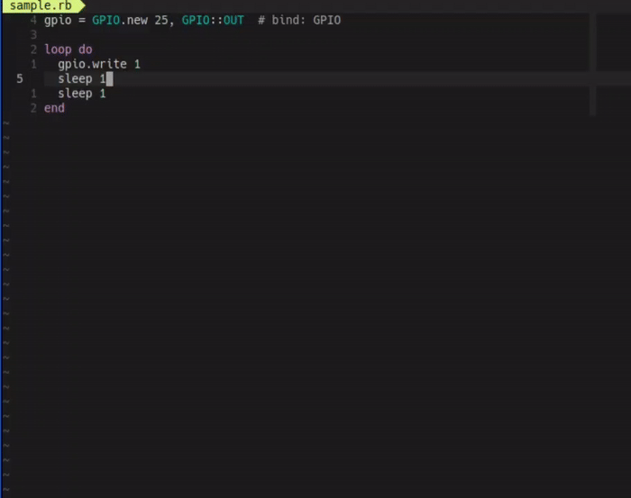
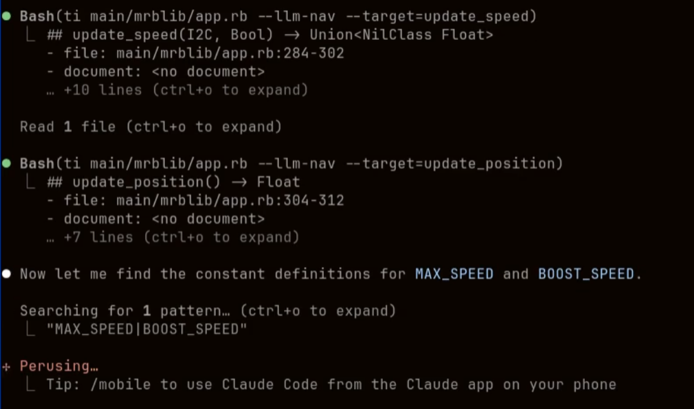
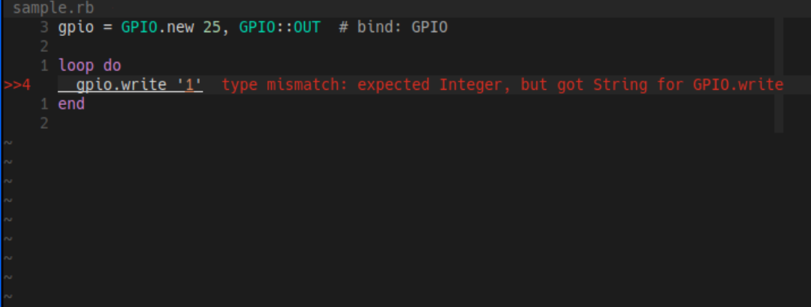
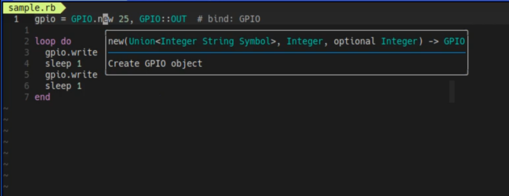
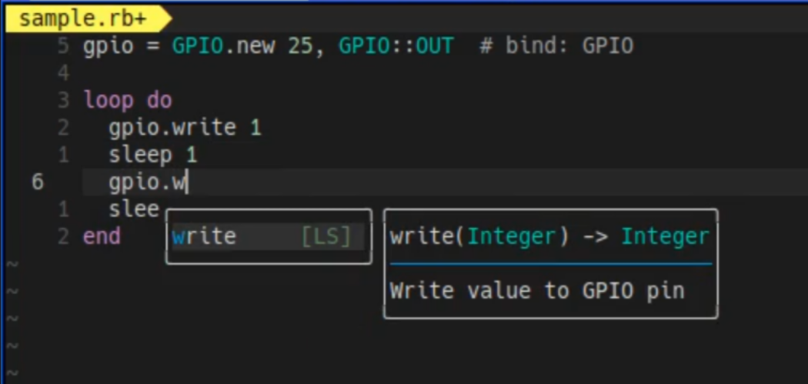
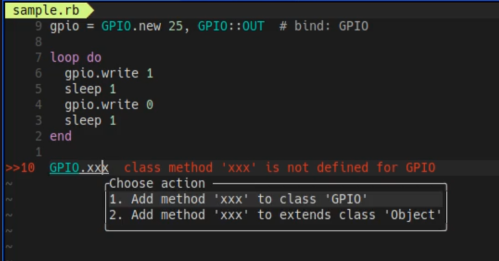
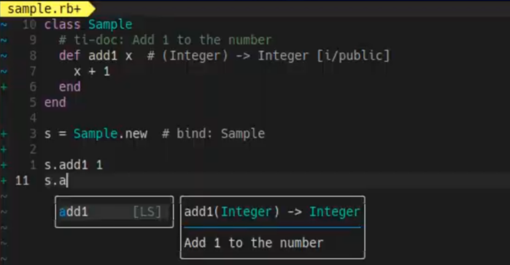
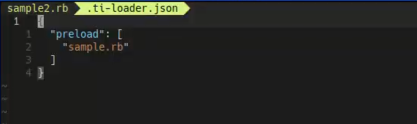
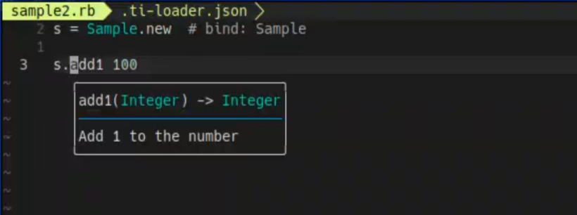

<div align="center">

# mruby-ti

**Static type checking for MRuby. No annotations required.**

[](https://go.dev/)
[](LICENSE)

</div>

---

mruby-ti is a static type analyzer for MRuby, designed for use by both humans and AI agents. It infers and checks types in your Ruby code without requiring any annotations — delivering real-time feedback in your editor and structured type analysis for AI-driven development.

**The power of static typing. The freedom of Ruby.**

<table align="center">
  <tr>
    <th>For Human</th>
    <th>For AI Agents</th>
  </tr>
  <tr>
    <td></td>
    <td></td>
  </tr>
</table>

## Features

- **Zero-annotation type inference** - No need to write type signatures. mruby-ti analyzes your code automatically
- **Real-time feedback** - Get instant type checking as you code through LSP integration
- **Customizable type system** - Define types that match your mruby environment
- **Editor integration** - Works with Neovim, VSCode, and any LSP-compatible editor
- **MRuby focused** - Built with embedded Ruby environments in mind
- **[Code Navigator for AI Agents](#code-navigator-for-ai-agents)** - Provide method signatures and call graphs to AI agents for efficient codebase understanding

## Requirements

- **Go 1.24.5+** 
- **Neovim** or **VSCode** (or any LSP-compatible editor)

## Quick Start

**Install mruby-ti:**

```bash
git clone https://github.com/engneer-hamachan/mruby-ti.git
cd mruby-ti
make install

# Add to PATH (fish example):
set -x PATH "/path/to/mruby-ti/bin:$PATH"
```

**Install LSP Server:**

```bash
git clone https://github.com/engneer-hamachan/ruby-ti-lsp.git
cd ruby-ti-lsp
make install

# Add to PATH (fish example):
set -x PATH "/path/to/ruby-ti-lsp/bin:$PATH"
```

**Setup your project:**

```bash
cd your-ruby-project
cp -r /path/to/mruby-ti/.ti-config .
```

**Configure your editor** - See [Editor Setup](#editor-setup) for detailed configuration.

That's it! Open a Ruby file and start coding with type checking enabled.

## Editor Setup

<details>
<summary>Neovim (coc.nvim)</summary>

Add to your `coc-settings.json`:

```json
{
  "languageserver": {
    "mruby-ti": {
      "command": "ti-lsp",
      "filetypes": ["ruby", "json"]
    }
  }
}
```

</details>

<details>
<summary>VSCode</summary>

Install the extension:

```bash
code --install-extension /path/to/ruby-ti-lsp/vscode/ruby-ti-lsp-0.1.0.vsix
```

</details>

<details>
<summary>Other Editors</summary>

Configure your LSP client to run `ti-lsp` for Ruby files. The server follows standard LSP protocols.

</details>

## Screenshots

**Diagnostics** - Real-time type error detection

<p align="center">
  
</p>

**Hover Information** - Inspect types on hover

<p align="center">
  
</p>

**Auto-completion** - Intelligent code suggestions

<p align="center">
  
</p>

**Code Actions** - Quick fixes and refactoring

<p align="center">
  
</p>

**Inline Documentation** - View method documentation directly in editor

<p align="center">
  
</p>

**External File Loading** - Analyze types across multiple files

<p align="center">
  
</p>

<p align="center">
  
</p>

## Configuration

### Supported Classes

mruby-ti is expanding support with a focus on **PicoRuby** and embedded environments:

`Array` · `Bool` · `Class` · `Enumerable` · `Float` · `GPIO` · `Hash` · `Integer` · `Kernel` · `Math` · `NilClass` · `Object` · `Proc` · `Range` · `String` · `Symbol`

More classes and PicoRuby features are being added continuously.

### Customization

The `.ti-config` directory contains type definitions that you can customize for your specific mruby environment. Edit the JSON files to define types that make sense for your workflow.

See the [Configuration Guide](./docs/ti-config.md) for detailed customization options.

## Documentation

- [.ti-config Configuration Guide](./docs/ti-config.md) - Customize type definitions for your environment

## Code Navigator for AI Agents
### Setup
After completing the mruby-ti setup,
install the skills from the `skills` directory into your AI agent.
```
# For Claude Code users, you can install with:
make install-skills
```
### Usage
```
/ti-navi app.rb {prompt}
```

The ti-navi skill uses mruby-ti's AI agent feature (`--llm-nav`) to provide
analysis results like the following:

````
## draw_frame(M5Canvas, M5GFX) -> NilClass
- file: main/mrblib/app.rb:416-496
- document: <no document>
- callers:
  - method: top level
    - class: none
    - call point: main/mrblib/app.rb:581
  - total callers: 1
- callees:
  - method: dist_sq
    - class: none
    - define point: main/mrblib/app.rb:281-286
  - method: dist_sq
    - class: none
    - define point: main/mrblib/app.rb:281-286
  - method: dist_sq
    - class: none
    - define point: main/mrblib/app.rb:281-286
  - method: draw_stars

````
The analysis results include method signatures and call graphs,
enabling far more efficient understanding of mruby codebases than grep.

Additionally, after code edits, the AI agent automatically performs type error checking,
preventing unnecessary runtime errors.

The image below shows Claude Code using ti-navi.
It leverages function call graphs to explore the codebase efficiently.

<p align="center">
  
</p>

## Beta Feature: Install RBS
The following commands convert an RBS file into a mruby-ti type configuration file (ti-config JSON) and install it.

```
# Install directly into the .ti-config directory
ti-rbs2json --install ./path/to/target.rbs

# Install into an arbitrary directory
ti-rbs2json -o ./path/to/directory ./path/to/target.rbs

# Output only (no install)
ti-rbs2json ./path/to/target.rbs
```

*RBS installation is a beta feature. Conversion may not always succeed — if that happens, manually edit the resulting type configuration file (ti-config JSON).


## Contributing

Issues and feedback are especially welcome! While the project is in active development and pull requests may be challenging to integrate, we'd love to hear about bugs, feature requests, and your experience using mruby-ti.

## License

MIT License - see [LICENSE](LICENSE) for details
