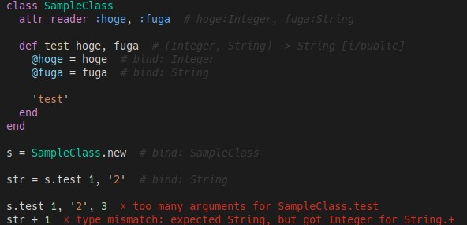

# Ruby-TI

<p align="center">
  
</p>

---

## はじめに
Ruby-TIはまだ少し動作不安定な所があり、現在動作不良を見つけ次第対応を行っている様な状態です。
動作が安定してきたらメジャーバージョンを0から1にする予定です。

あんまりいないとは思いますが遊び程度に使ってもらって、
動かないコードや型推論におかしい箇所があれば報告頂けるとめっちゃ嬉しいです！


## Ruby-TIとは
Ruby-TIは、Go言語で書かれたmruby用の静的型解析器です。

解析対象のmrubyコードに対して実行すると、
パース→型推論→型検査までを行います。

### 例
<p align="center">
  
</p>

## なぜRuby-TIを作ったか
私はインタプリタ言語(とりわけRuby)が大好きです。

Rubyは書いたらすぐに実行でき、
（動かすだけなら）不要な型システムも覚える必要がありません。

朝起きて何か閃いた時、
少し時間が余ったからコードで遊んで見ようって時、

Rubyはたくさん選ばれてきたんじゃないかと思います。

そして、そんな時間をもっと気軽に楽しくする為にRuby-TIを作りました。

あと、やっぱり型を書かなくても型のチェックが受けられる開発体験は、
なんか新鮮で面白いです。

## 特徴
- **高いカスタマイズ性**: 後述のBuiltin JSON設定で、様々なmruby環境の型検査器を構築する事ができます
- **Vimプラグイン**: おまけ程度ですが、一応Vimプラグインをセットで提供しています。
- **気合いのパーサー**: 気合いでパーサーを書いてしまったので、お気持ちを感じるコードになっています。

## インストール
Go言語の1.24.5以上のバージョンが必要になります。

```bash
go version

# Goがインストールされてるか確認
```

```bash
# リポジトリをクローン
git clone https://github.com/engneer-hamachan/ruby-ti.git
cd ruby-ti

# システムにインストール
make install
```
`ti`バイナリをビルドして`./bin/`ディレクトリに配置します。

## 使用方法
```bash
# インストール済みバイナリを使用（PATHに/path/to/ruby-ti/binを追加して下さい）
ti your_file.rb

# または直接指定
/path/to/ruby-ti/bin/ti sample.rb

# 結果
./sample.rb::5::type mismatch: expected Union<Integer Float>, but got String for Integer.+
```


## エディタ統合
### LSP (Language Server Protocol)
Ruby-TI用のLSPサーバーを作りました！！！なんとVSCodeも対応してます！

- **Code Lens**: メソッド定義に型シグネチャをインライン表示
- **Code Completion**: 型推論に基づいたメソッド補完
- **Go to Definition**: メソッドやクラス定義へのジャンプ
- **Diagnostics**: リアルタイム型エラー検出

詳細は [ruby-ti-lsp](https://github.com/engneer-hamachan/ruby-ti-lsp) をご覧ください。


## JSON設定システム（Buitin JSON）
Ruby-TIはJSONベースの設定システムを使用して、Rubyの組み込みメソッドの型を定義できます。
これにより、Goコードを変更することなく型解析器を拡張できます。

### Buitin JSONの設定方法
1. 開発中プロジェクトのルートディレクトリに`.ti-config`ディレクトリをコピー
2. コピーした`.ti-config`内のJSONを編集（または追加）する

### 例
picorubyで使えるGPIOクラスの例

```jsonc
{
  "frame": "Builtin",
  "class": "GPIO",
  "instance_methods": [
    {
      "name": "high?",
      "arguments": [],
      "return_type": {"type": ["Bool"]}
    },
    {
      "name": "low?",
      "arguments": [],
      "return_type": {"type": ["Bool"]}
    },
    {
      "name": "open_drain",
      "arguments": [{"type": ["Int"]}],
      "return_type": {"type": ["Int"]}
    },
    {
      "name": "read",
      "arguments": [],
      "return_type": {"type": ["Int"]}
    },
    {
      "name": "write",
      "arguments": [{"type": ["Int"]}],
      "return_type": {"type": ["Int"]}
    }
  ],
  "class_methods": [
    {
      "name": "high_at?",
      "arguments": [{"type": ["Int", "String", "Symbol"]}],
      "return_type": {"type": ["Bool"]}
    },
    {
      "name": "low_at?",
      "arguments": [{"type": ["Int"]}],
      "return_type": {"type": ["Bool"]}
    },
    {
      "name": "new",
      "arguments": [
        {"type": ["Int", "String", "Symbol"]},
        {"type": ["Int"]},
        {"type": ["DefaultInt"]}
      ],
      "return_type": {"type": ["GPIO"]}
    },
    {
      "name": "open_drain_at",
      "arguments": [{"type": ["Int", "String", "Symbol"]}],
      "return_type": {"type": ["Int"]}
    },
    {
      "name": "pull_down_at",
      "arguments": [{"type": ["Int", "String", "Symbol"]}],
      "return_type": {"type": ["Int"]}
    },
    {
      "name": "pull_up_at",
      "arguments": [{"type": ["Int", "String", "Symbol"]}],
      "return_type": {"type": ["Int"]}
    },
    {
      "name": "read_at",
      "arguments": [{"type": ["Int", "String", "Symbol"]}],
      "return_type": {"type": ["Int"]}
    },
    {
      "name": "set_dir_at",
      "arguments": [
        {"type": ["Int", "String", "Symbol"]},
        {"type": ["Int"]}
      ],
      "return_type": {"type": ["Int"]}
    },
    {
      "name": "set_function_at",
      "arguments": [
        {"type": ["Int", "String", "Symbol"]},
        {"type": ["Int"]}
      ],
      "return_type": {"type": ["Int"]}
    },
    {
      "name": "write_at",
      "arguments": [
        {"type": ["Int", "String", "Symbol"]},
        {"type": ["Int"]}
      ],
      "return_type": {"type": ["Int"]}
    }
  ],
  "constants": [
    {
      "name": "OUT",
      "return_type": {"type": ["Int"]}
    }
  ]
}
```
### 基本構造
```jsonc
{
  "frame": "Builtin",            // フレーム名（通常は "Builtin"）
  "class": "ClassName",          // クラス名
  "extends": ["ParentClass"],    // 継承する親クラス（オプション）
  "constants": [{}],             // クラス定数定義（オプション）
  "instance_methods": [{}],      // インスタンスメソッド定義（オプション）
  "class_methods": [{}]          // クラスメソッド定義（オプション）
}
```

### メソッド定義
```jsonc
{
  "name": "method_name",         // メソッド名
  "arguments": [                 // 引数定義（オプション）
    {
      "type": ["String"],        // 引数の型（配列形式*複数指定するとユニオン型になります）
      "key": "keyword_name",     // キーワード引数名（オプション）
      "is_asterisk": true        // 可変長引数フラグ（オプション）
    }
  ],
  "return_type": {               // 戻り値型定義
    "type": ["String", "Nil"],   // 戻り値型（配列形式*複数指定するとユニオン型になります）
    "is_conditional": false,     // 条件付き戻り値フラグ（オプション）
    "is_destructive": false      // 破壊的操作フラグ（オプション）
  },
  "block_parameters": ["String"] // ブロックパラメータ（オプション）
}
```

### 定数定義
```jsonc
{
  "name": "CONSTANT_NAME",
  "return_type": {
    "type": ["Int"]
  }
}
```

### サポートされる型
- `"Nil"` - Nilです
- `"Symbol"` - シンボル
- `"Bool"` - 真偽値
- `"Block"` - ブロック
- `"DefaultBlock"` - デフォルト引数のブロック
- `"Range"` - レンジ
- `"Untyped"` - いわゆるAny型
- `"DefaultUntyped"` - デフォルト引数のUntyped
- `"String"` - 文字列
- `"DefaultString"` - デフォルト引数の文字列
- `"OptionalString"` - Nilもしくは文字列
- `"Int"` - 数値
- `"DefaultInt"` - デフォルト引数の数値
- `"OptionalInt"` - Nilもしくは数値
- `"Float"` - 実数
- `"DefaultFloat"` - デフォルト引数の実数
- `"OptionalFloat"` - Nilもしくは実数
- `"Array"` - 配列
- `"Hash"` - ハッシュ
- `"StringArray"` - 文字列の配列
- `"IntArray"` - 数値の配列
- `"FloatArray"` - 実数の配列
- `"KeyArray"` - ハッシュのKey配列
- `"KeyValueArray"` - ハッシュのValue配列
- `"Self"` - インスタンスオブジェクト
- `"Number"` - 実数もしくは数値
- `"Unify"` - Hash・Array・Union型をUnifyしたUnion型
- `"OptionalUnify"` - NilもしくはUnify
- `"BlockResultArray"` - ブロックの結果を配列にする型
- `"SelfConvertArray"` - インスタンスオブジェクトを配列に変換する型
- `"SelfArgument"` - 引数をそのまま返す型
- `"UnifiedSelfArgument"` - 引数をUnifyしてから返す型

## ライセンス
このプロジェクトはMITライセンスの下でライセンスされています

---
