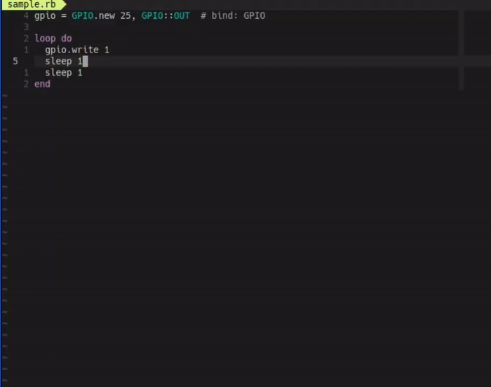
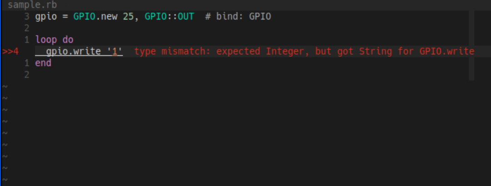
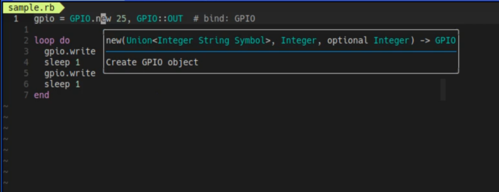
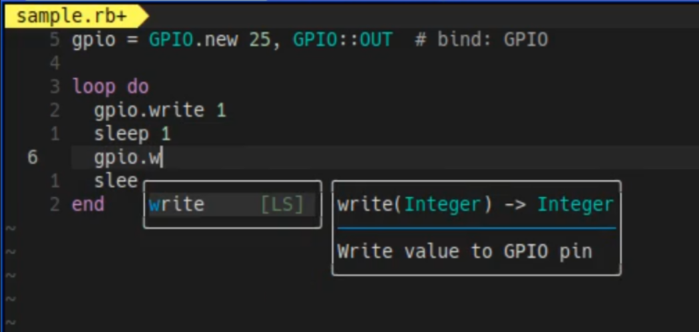
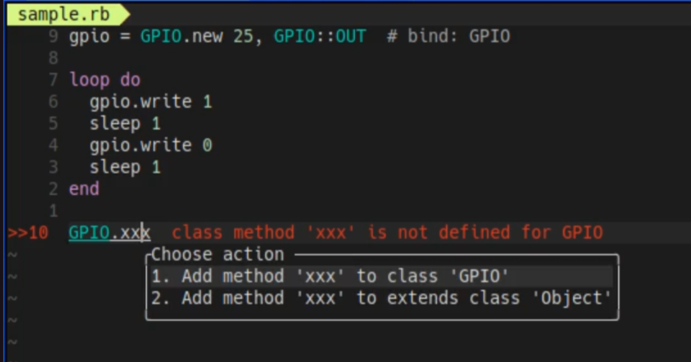

<div align="center">

# Ruby-TI

**Static type checking for MRuby. No annotations required.**

[Features](#-features) · [Quick Start](#-quick-start) · [Configuration](#-configuration) · [Documentation](#-documentation)

[](https://go.dev/)
[](LICENSE)
[](https://mruby.org/)

</div>

---

Ruby-TI is a static type analyzer for MRuby that performs type inference and checking on your Ruby code without requiring type annotations. Write Ruby naturally and get real-time type feedback in your editor.

**The power of static typing. The freedom of Ruby.**

<p align="center">
  
</p>

## Features

- **Zero-annotation type inference** - No need to write type signatures. Ruby-TI analyzes your code automatically
- **Real-time feedback** - Get instant type checking as you code through LSP integration
- **Customizable type system** - Define types that match your mruby environment
- **Editor integration** - Works with Neovim, VSCode, and any LSP-compatible editor
- **PicoRuby focused** - Built with embedded Ruby environments in mind

## Requirements

- **Go 1.24.5+** for building from source
- **Neovim** or **VSCode** (or any LSP-compatible editor)

## Quick Start

**Install Ruby-TI:**

```bash
git clone https://github.com/engneer-hamachan/ruby-ti.git
cd ruby-ti
make install

# Add to PATH (fish example):
set -x PATH "/path/to/ruby-ti/bin:$PATH"
```

**Install LSP Server:**

```bash
git clone https://github.com/engneer-hamachan/ruby-ti-lsp.git
cd ruby-ti-lsp
make install

# Add to PATH (fish example):
set -x PATH "/path/to/ruby-ti-lsp/bin:$PATH"
```

**Setup your project:**

```bash
cd your-ruby-project
cp -r /path/to/ruby-ti/.ti-config .
```

**Configure your editor** - See [Editor Setup](#editor-setup) for detailed configuration.

That's it! Open a Ruby file and start coding with type checking enabled.

## Editor Setup

<details>
<summary>Neovim (coc.nvim)</summary>

Add to your `coc-settings.json`:

```json
{
  "languageserver": {
    "ruby-ti": {
      "command": "ti-lsp",
      "filetypes": ["ruby", "json"]
    }
  }
}
```

</details>

<details>
<summary>VSCode</summary>

Install the extension:

```bash
code --install-extension /path/to/ruby-ti-lsp/vscode/ruby-ti-lsp-0.1.0.vsix
```

</details>

<details>
<summary>Other Editors</summary>

Configure your LSP client to run `ti-lsp` for Ruby files. The server follows standard LSP protocols.

</details>

## Screenshots

**Diagnostics** - Real-time type error detection

<p align="center">
  
</p>

**Hover Information** - Inspect types on hover

<p align="center">
  
</p>

**Auto-completion** - Intelligent code suggestions

<p align="center">
  
</p>

**Code Actions** - Quick fixes and refactoring

<p align="center">
  
</p>

## Configuration

### Supported Classes

Ruby-TI is expanding support with a focus on **PicoRuby** and embedded environments:

`Array` · `Bool` · `Class` · `Enumerable` · `Float` · `GPIO` · `Hash` · `Integer` · `Kernel` · `Math` · `Nil` · `Object` · `Proc` · `Range` · `String` · `Symbol`

More classes and PicoRuby-specific features are being added continuously.

### Customization

The `.ti-config` directory contains type definitions that you can customize for your specific mruby environment. Edit the JSON files to define types that make sense for your workflow.

See the [Configuration Guide](./docs/ti-config.md) for detailed customization options.

## Documentation

- [.ti-config Configuration Guide](./docs/ti-config.md) - Customize type definitions for your environment

## Contributing

Issues and feedback are especially welcome! While the project is in active development and pull requests may be challenging to integrate, we'd love to hear about bugs, feature requests, and your experience using Ruby-TI.

## License

MIT License - see [LICENSE](LICENSE) for details
