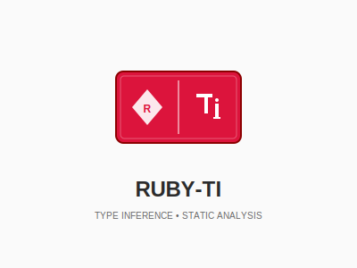
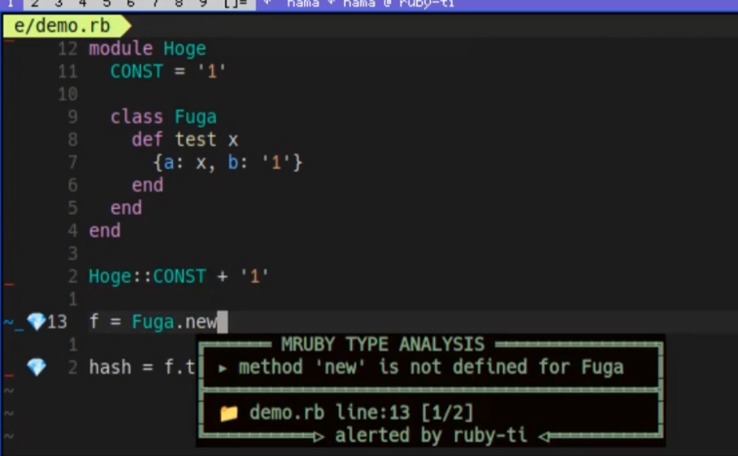

# Ruby-TI

<p align="center">
  
</p>

---

## Introduction
Ruby-TI is still somewhat unstable in operation, and we are currently addressing operational issues as we find them.
We plan to upgrade the major version from 0 to 1 once the operation becomes stable.

While there probably aren't many users yet, we'd love for you to try it out as a fun experiment,
and it would make us incredibly happy if you report any code that doesn't work or any strange type inference issues!

## What is Ruby-TI?
Ruby-TI is a static type analyzer for mruby written in Go.

When executed on target mruby code, it performs parsing → type inference → type checking.

<p align="center">
  
</p>

## Why Ruby-TI was Created
I love interpreted languages (especially Ruby).

Ruby can be executed immediately after writing,
and you don't need to learn unnecessary type systems (at least just to run it).

When you wake up in the morning with an inspiration,
when you have some spare time and want to play with code,

I think Ruby has been chosen many times in such situations.

And to make such moments more enjoyable and fun, I created Ruby-TI.

Also, the development experience of getting type checking without writing types
is somehow fresh and interesting.

## Features
- **High Customizability**: With the Builtin JSON configuration described later, you can build type checkers for various mruby environments
- **Vim Plugin**: Though somewhat basic, we provide a Vim plugin as a bonus.
- **Parser with Spirit**: Since I wrote the parser with determination, the code reflects that passion.

## Installation
Requires Go version 1.24.5 or higher.

```bash
go version

# Check if Go is installed
```

```bash
# Clone the repository
git clone https://github.com/engneer-hamachan/ruby-ti.git
cd ruby-ti

# Install to system
sh ./shell/install.sh
```
The install script builds the `ti` binary and places it in the `./bin/` directory.

## Usage
```bash
# Use installed binary (please add /path/to/ruby-ti/bin to your PATH)
ti your_file.rb

# Or specify directly
/path/to/ruby-ti/bin/ti your_file.rb
```

### Usage Example
```ruby
a = 1
b = "1"
c = b

a + c
```

```bash
$ /path/to/ruby-ti/bin/ti sample.rb
./sample.rb::5::type mismatch: expected Union<Integer Float>, but got String for Integer.+
```

## JSON Configuration System (Builtin JSON)
Ruby-TI uses a JSON-based configuration system to define types for Ruby's built-in methods.
This allows extending the type analyzer without modifying Go code.

Additionally, the configuration JSON is embedded into the code at installation time (Go compile time) and built,
so no unnecessary loading occurs at runtime.

### How to Configure Builtin JSON
1. Create a new JSON file in `builtin/builtin_config/`
2. Or edit an existing JSON file for a class
3. Reinstall to apply the configuration

### Example
Example of a GPIO class that can be used with picoruby

```jsonc
{
  "frame": "Builtin",
  "class": "GPIO",
  "instance_methods": [
    {
      "name": "high?",
      "arguments": [],
      "return_type": {"type": ["Bool"]}
    },
    {
      "name": "low?",
      "arguments": [],
      "return_type": {"type": ["Bool"]}
    },
    {
      "name": "open_drain",
      "arguments": [{"type": ["Int"]}],
      "return_type": {"type": ["Int"]}
    },
    {
      "name": "read",
      "arguments": [],
      "return_type": {"type": ["Int"]}
    },
    {
      "name": "write",
      "arguments": [{"type": ["Int"]}],
      "return_type": {"type": ["Int"]}
    }
  ],
  "class_methods": [
    {
      "name": "high_at?",
      "arguments": [{"type": ["Int", "String", "Symbol"]}],
      "return_type": {"type": ["Bool"]}
    },
    {
      "name": "low_at?",
      "arguments": [{"type": ["Int"]}],
      "return_type": {"type": ["Bool"]}
    },
    {
      "name": "new",
      "arguments": [
        {"type": ["Int", "String", "Symbol"]},
        {"type": ["Int"]},
        {"type": ["DefaultInt"]}
      ],
      "return_type": {"type": ["GPIO"]}
    },
    {
      "name": "open_drain_at",
      "arguments": [{"type": ["Int", "String", "Symbol"]}],
      "return_type": {"type": ["Int"]}
    },
    {
      "name": "pull_down_at",
      "arguments": [{"type": ["Int", "String", "Symbol"]}],
      "return_type": {"type": ["Int"]}
    },
    {
      "name": "pull_up_at",
      "arguments": [{"type": ["Int", "String", "Symbol"]}],
      "return_type": {"type": ["Int"]}
    },
    {
      "name": "read_at",
      "arguments": [{"type": ["Int", "String", "Symbol"]}],
      "return_type": {"type": ["Int"]}
    },
    {
      "name": "set_dir_at",
      "arguments": [
        {"type": ["Int", "String", "Symbol"]},
        {"type": ["Int"]}
      ],
      "return_type": {"type": ["Int"]}
    },
    {
      "name": "set_function_at",
      "arguments": [
        {"type": ["Int", "String", "Symbol"]},
        {"type": ["Int"]}
      ],
      "return_type": {"type": ["Int"]}
    },
    {
      "name": "write_at",
      "arguments": [
        {"type": ["Int", "String", "Symbol"]},
        {"type": ["Int"]}
      ],
      "return_type": {"type": ["Int"]}
    }
  ],
  "constants": [
    {
      "name": "OUT",
      "return_type": {"type": ["Int"]}
    }
  ]
}
```
### Basic Structure
```jsonc
{
  "frame": "Builtin",            // Frame name (usually "Builtin")
  "class": "ClassName",          // Class name
  "extends": ["ParentClass"],    // Parent class to inherit from (optional)
  "constants": [{}],             // Class constant definitions (optional)
  "instance_methods": [{}],      // Instance method definitions (optional)
  "class_methods": [{}]          // Class method definitions (optional)
}
```

### Method Definition
```jsonc
{
  "name": "method_name",         // Method name
  "arguments": [                 // Argument definitions (optional)
    {
      "type": ["String"],        // Argument type (array format *multiple specifications create union types)
      "key": "keyword_name",     // Keyword argument name (optional)
      "is_asterisk": true        // Variable length argument flag (optional)
    }
  ],
  "return_type": {               // Return type definition
    "type": ["String", "Nil"],   // Return type (array format *multiple specifications create union types)
    "is_conditional": false,     // Conditional return flag (optional)
    "is_destructive": false      // Destructive operation flag (optional)
  },
  "block_parameters": ["String"] // Block parameters (optional)
}
```

### Constant Definition
```jsonc
{
  "name": "CONSTANT_NAME",
  "return_type": {
    "type": ["Int"]
  }
}
```

### Supported Types
- `"Nil"` - Nil
- `"Symbol"` - Symbol
- `"Bool"` - Boolean
- `"Block"` - Block
- `"DefaultBlock"` - Default argument block
- `"Range"` - Range
- `"Untyped"` - Any type
- `"DefaultUntyped"` - Default argument Untyped
- `"String"` - String
- `"DefaultString"` - Default argument string
- `"OptionalString"` - Nil or string
- `"Int"` - Integer
- `"DefaultInt"` - Default argument integer
- `"OptionalInt"` - Nil or integer
- `"Float"` - Float
- `"DefaultFloat"` - Default argument float
- `"OptionalFloat"` - Nil or float
- `"Array"` - Array
- `"Hash"` - Hash
- `"StringArray"` - Array of strings
- `"IntArray"` - Array of integers
- `"FloatArray"` - Array of floats
- `"KeyArray"` - Hash key array
- `"KeyValueArray"` - Hash value array
- `"Self"` - Instance object
- `"Number"` - Float or integer
- `"Unify"` - Union type that unifies Hash, Array, and Union types
- `"OptionalUnify"` - Nil or Unify
- `"BlockResultArray"` - Type that converts block results to array
- `"SelfConvertArray"` - Type that converts instance object to array
- `"SelfArgument"` - Type that returns argument as is
- `"UnifiedSelfArgument"` - Type that unifies argument before returning

## Editor Integration

### LSP (Language Server Protocol)
An LSP server for Ruby-TI is available, providing the following features:

- **Code Lens**: Inline type signature display at method definitions
- **Code Completion**: Type-aware method auto-completion
- **Go to Definition**: Jump to method and class definitions
- **Diagnostics**: Real-time type error detection

For more details, see [ruby-ti-lsp](https://github.com/engneer-hamachan/ruby-ti-lsp).

### Vim Plugin
Ruby-TI includes a dedicated Vim plugin as a bonus. (It's really just a bonus)

#### Setup
```vim
" Tested with NVIM v0.11.3.

" Add to ~/.config/nvim/init.vim
set rtp+=/path/to/ruby-ti/ruby-ti.vim

let g:ruby_ti_config = {
  \ 'animation_speed': 15,
  \ 'auto_run': 0,
  \ 'checker_command': 'ti',
  \ 'enable_animation': 1,
  \ 'enable_line_highlighting': 1,
  \ 'mark': '💎'
\ }
```

#### Usage
Open a Ruby file in Vim and use the following command:
- `:RubyTiRun` - Type check the current file

## Future Development
### First, enrich the type definitions (Builtin JSON configuration) for major classes and methods
Currently, we have only completed the type definitions for Builtin-related classes in the Picoruby documentation.
We aim to further enrich this so that it can be used to some extent (without setting up JSON yourself) upon installation.

### Make all methods definable with JSON configuration only
Some features that couldn't be realized with JSON configuration alone, such as the Array.append method,
are currently implemented individually in the Ruby-TI main body.

We want to be able to handle all of these with JSON configuration alone.

### Fix mruby code that cannot be parsed (escape from the parser with spirit)
We are still fixing code as we find it, but intuitively, there seem to be quite a few more...
Since there are many excellent theories and approaches for parsers in the world,
we want to adopt one of them and aim for a more stable parser.

### External file loading
Since we have a strong desire to first properly support small-scale code like scripts,
we currently ignore external file loading such as require.

Once development progresses further, we would like to consider adding external file loading functionality.

## License
This project is licensed under the MIT License

---